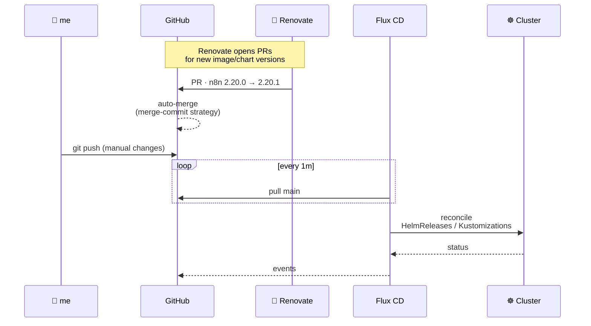

<div align="center">

# 🏠 homeops

**A single-node, GitOps-managed Kubernetes homelab — running on Talos, reconciled by Flux, and entirely declared in this repo.**

<br />

[](https://www.talos.dev)
[](https://kubernetes.io)
[](https://fluxcd.io)
[](https://docs.renovatebot.com)

[](https://github.com/andrei-iacobb/homeops/commits/main)
[](https://github.com/andrei-iacobb/homeops/pulse)
[](https://github.com/andrei-iacobb/homeops)
[](https://github.com/andrei-iacobb/homeops/pulls)
[](https://github.com/andrei-iacobb/homeops/stargazers)

<br />

**[📊 Dependency Dashboard](https://github.com/andrei-iacobb/homeops/issues?q=is%3Aissue+is%3Aopen+%22Renovate+Dashboard%22)** ·
**[🏡 Internal Dashboard](https://home.iacob.uk)** ·
**[🌍 Public Site](https://iacob.co.uk)**

</div>

---

## 📡 At a glance

```
  Cluster      home-cluster        ·  single-node Talos Linux
  Reconciler   Flux CD             ·  watches main, auto-applies on push
  CNI          Cilium              ·  with LBIPAM + Gateway API
  Storage      OpenEBS + NFS-CSI   ·  hostpath for state, TrueNAS for media
  Backups      VolSync → MinIO     ·  restic, daily, off-cluster
  Secrets      SOPS + age          ·  encrypted at rest, decrypted by Flux
  Updates      Renovate (auto)     ·  PRs auto-merged with merge commits
```

| Namespace | Apps |  | Namespace | Apps |
|---|---|---|---|---|
| `default` | 31 |  | `monitoring` | 10 |
| `media` | 30 |  | `databases` | 6 |
| `network` | 6 |  | `ai` | 4 |
| `kube-system` | 4 |  | `storage` | 4 |
| `cert-manager` | 1 |  | **Total** | **~96** |

---

## 🏗️ Architecture

```mermaid
flowchart TB
    subgraph internet["🌐 Internet"]
        cf[Cloudflare<br/>Tunnel + DNS]
    end

    subgraph lan["🏠 LAN · 192.168.1.0/24"]
        direction TB

        subgraph proxmox["Proxmox Cluster"]
            direction LR
            dl360["DL360 Gen9<br/>48 vCPU · 252 GiB"]
            dl380["DL380 Gen9<br/>40 vCPU · 157 GiB"]
        end

        subgraph k8s["Talos · home-cluster (single node)"]
            direction TB
            envoy_ext[Envoy External<br/>192.168.1.8]
            envoy_int[Envoy Internal<br/>192.168.1.7]
            apps[("96 apps across<br/>10 namespaces")]
            envoy_ext --> apps
            envoy_int --> apps
        end

        nas[(TrueNAS<br/>media · backups)]
        ha[Home Assistant<br/>VM]
        adguard[AdGuard Home<br/>DNS · ad-block]

        proxmox --> k8s
        proxmox --> nas
        proxmox --> ha
        k8s -- NFS · 10G P2P --- nas
    end

    user[👤 User] -. iacob.uk · LAN/VPN .-> envoy_int
    cf -- iacob.co.uk .-> envoy_ext
    user -. iacob.co.uk · public .-> cf
    adguard -. split DNS .-> envoy_int

    classDef ext fill:#f38020,stroke:#fff,color:#fff
    classDef k fill:#326ce5,stroke:#fff,color:#fff
    classDef storage fill:#0096d6,stroke:#fff,color:#fff
    class cf ext
    class envoy_ext,envoy_int,apps k
    class nas storage
```

---

## 🖥️ Hardware

| Host | Model | CPU | RAM | Role |
|---|---|---|---|---|
| **dl360** | HP ProLiant DL360 Gen9 | 48 vCPU | 252 GiB | Compute · K8s VM, AdGuard, Home Assistant, WireGuard |
| **dl380** | HP ProLiant DL380 Gen9 | 40 vCPU | 157 GiB | Storage · TrueNAS, AdGuard secondary |
| **Total** | | **88 vCPU** | **409 GiB** | |

Network backbone: 1G LAN + dedicated **10G P2P** between K8s node and TrueNAS for NFS traffic.

---

## 🧱 The Stack

<table>
<tr>
<td>

**Platform**
- [Talos Linux](https://www.talos.dev) · immutable K8s OS
- [Kubernetes](https://kubernetes.io) · v1.35
- [Flux CD](https://fluxcd.io) · GitOps reconciler
- [Renovate](https://docs.renovatebot.com) · automated dep updates
- [SOPS + age](https://github.com/getsops/sops) · encrypted secrets

</td>
<td>

**Networking**
- [Cilium](https://cilium.io) · CNI + LBIPAM
- [Envoy Gateway](https://gateway.envoyproxy.io) · Gateway API
- [cert-manager](https://cert-manager.io) · TLS automation
- [k8s_gateway](https://github.com/ori-edge/k8s_gateway) · cluster DNS
- [Cloudflare Tunnel](https://www.cloudflare.com/products/tunnel/) · zero-trust ingress

</td>
<td>

**Storage & Data**
- [OpenEBS](https://openebs.io) · hostpath PVs
- [NFS CSI](https://github.com/kubernetes-csi/csi-driver-nfs) · TrueNAS shares
- [VolSync](https://volsync.readthedocs.io) · restic backups → MinIO
- [PostgreSQL](https://www.postgresql.org) · primary RDBMS
- [MinIO](https://min.io) · S3-compatible object store

</td>
</tr>
</table>

---

## 📦 Applications

> Inventory derived from [`kubernetes/apps/`](./kubernetes/apps). Click a section to expand.

<details>
<summary><b>🎬 Media · 30 apps</b> — *arr stack, streaming, transcoding, surveillance</summary>

| Category | Apps |
|---|---|
| **Streaming** | Plex · Jellyfin · ErsatzTV · Tautulli |
| **Movies / TV** | Sonarr · Sonarr-LowQ · Radarr · Radarr-LowQ |
| **Books / Audio** | Readarr · Lidarr · Lidify · Calibre-Web · LazyLibrarian |
| **Indexers / Subs** | Prowlarr · Bazarr · FlareSolverr |
| **Downloaders** | qBittorrent · SABnzbd |
| **Requests / Discovery** | Overseerr · Recommendarr · Pulsarr · Wizarr |
| **Tooling** | Tdarr · Recyclarr · Huntarr · Agregarr · Sharerr · Plexo |
| **Surveillance / IoT** | Frigate · Scrypted · Ring-MQTT |

</details>

<details>
<summary><b>🛠️ Default · 31 apps</b> — productivity, identity, utilities, hosted services</summary>

| Category | Apps |
|---|---|
| **Identity & Auth** | Authentik · Vaultwarden |
| **Files & Photos** | Immich · Paperless · FileBrowser · SFTPGo · Zipline |
| **Knowledge** | Outline · Mealie · Vikunja |
| **Dev & Code** | Gitea · code-server · IT-Tools · Stirling-PDF |
| **Dashboards** | Homepage · Glance · Echo |
| **Automation** | n8n |
| **Finance & Home** | Actual-Budget · Wallos · Solis-Charge · NeatPlan |
| **Network & Web** | Shlink · SearXNG · OpenSpeedTest · UniFi · Website |
| **Hardware** | iLO4 Fan Controller · Informate · Replicarr |

</details>

<details>
<summary><b>🤖 AI · 4 apps</b> — local inference & RAG</summary>

| App | Purpose |
|---|---|
| **Ollama** | Local LLM inference (CPU + GPU) |
| **Open WebUI** | Chat-style UI for Ollama |
| **AnythingLLM** | RAG over private documents |
| **Arca** | Custom AI workflow |

</details>

<details>
<summary><b>📊 Monitoring · 10 apps</b> — metrics, logs, traces, status</summary>

| Stack | Apps |
|---|---|
| **Metrics** | Prometheus · Grafana · Alloy · Graphite-Exporter · Exporters (TrueNAS, ProxmoxVE, AdGuard, iLO) |
| **Logs** | Loki · Promtail |
| **Status & Health** | Uptime-Kuma · Scrutiny (disk SMART) |
| **Web Analytics** | Plausible |

</details>

<details>
<summary><b>🗄️ Databases · 6 apps</b></summary>

PostgreSQL (CNPG) · MariaDB · Redis · MinIO · Qdrant · Mosquitto (MQTT) · pgAdmin

</details>

<details>
<summary><b>🌐 Network · 6 apps</b></summary>

Envoy Gateway · Cloudflare Tunnel · Cloudflare DDNS · Cloudflare DNS · k8s_gateway · Headscale

</details>

<details>
<summary><b>⚙️ System</b> — kube-system, storage, cert-manager</summary>

Cilium · CoreDNS · Metrics-Server · Reloader · NFS-CSI (×2) · OpenEBS · VolSync · cert-manager

</details>

---

## 🔄 GitOps Workflow



**Update strategy** — patch/minor container, helm, github-release, github-action, and mise updates auto-merge as standard merge commits. Major versions and critical infra (Talos, ClickHouse, Postgres, MariaDB, Redis, MinIO, Plex, Envoy, Cilium, cert-manager) are held for manual review via the [Dependency Dashboard](https://github.com/andrei-iacobb/homeops/issues?q=is%3Aissue+is%3Aopen+%22Renovate+Dashboard%22).

---

## 🗂️ Repository Layout

```
homeops/
├── bootstrap/            # one-shot Helmfile to seed the cluster
├── kubernetes/
│   ├── apps/             # one folder per workload, grouped by namespace
│   │   ├── ai/  default/  databases/  media/  monitoring/
│   │   ├── network/  storage/  cert-manager/  kube-system/
│   │   └── external-services/   # things outside the cluster (HA, iLO, Minecraft)
│   ├── components/       # reusable bits — volsync, sops, gatus probes
│   └── flux/             # Flux Kustomization graph + meta repos
├── talos/
│   ├── talconfig.yaml    # talhelper input
│   ├── talenv.yaml       # pinned Talos + K8s versions (Renovate-managed)
│   └── patches/          # node-level Talos patches
├── .taskfiles/           # task runners (flux, talos, volsync, k8s)
└── .renovaterc.json5     # update policy
```

Each app follows a consistent shape — `ks.yaml` (Flux Kustomization) + `app/` (HelmRelease, OCIRepository, optional HTTPRoute and SOPS secret). Most apps use [`bjw-s/app-template`](https://github.com/bjw-s-labs/helm-charts).

---

## 🔌 Networking & Access

| Gateway | IP | Domain | Exposure |
|---|---|---|---|
| `envoy-internal` | `192.168.1.7` | `*.iacob.uk` | LAN + WireGuard only |
| `envoy-external` | `192.168.1.8` | `*.iacob.co.uk` | Public via Cloudflare Tunnel |

Public services sit behind a Cloudflare Tunnel — no inbound ports, DDoS protection at the edge, optional Authentik in front of sensitive apps. Internal services resolve via AdGuard Home split DNS so `*.iacob.uk` points at the internal Envoy, even from outside via WireGuard.

---

## 🔧 Operations

```bash
# Status overview
flux get all -A
kubectl get pods -A | grep -v Running | grep -v Completed

# Force a reconcile
task reconcile                                    # whole cluster
flux reconcile ks <name> -n <ns> --with-source    # one app

# Talos lifecycle
task talos:generate-config
task talos:apply-node IP=<ip>
task talos:upgrade-node IP=<ip>

# Backups (VolSync → TrueNAS MinIO)
task volsync:backup-all
task volsync:status

# Secrets (SOPS + age)
sops <file.sops.yaml>                             # edit
sops -e -i <file.sops.yaml>                       # encrypt in place
```

---

## 🙏 Credits

Built on the shoulders of the homelab community — primarily [`onedr0p/cluster-template`](https://github.com/onedr0p/cluster-template), with patterns borrowed from [`onedr0p/home-ops`](https://github.com/onedr0p/home-ops), [`DavidIlie/home-cluster`](https://github.com/DavidIlie/home-cluster), and discoveries via [kubesearch.dev](https://kubesearch.dev).

<div align="center">
<br />

**[home.iacob.uk](https://home.iacob.uk)** · internal · **[iacob.co.uk](https://iacob.co.uk)** · public

<sub>Reconciled by Flux. Updated by Renovate. Maintained by coffee. ☕</sub>

</div>
